# 1. Introducción a consultas JPA

### Especificación de JPA para consultas
 <aside style="border: 2px solid yellow; padding: 10px; border-radius: 5px;"> 
	Las <b>consultas JPA</b> son aquellas que se realizan sobre las <b>entidades</b> de la base de datos.
</aside>

 Pueden hacerse de varias formas:
### a. Lenguajes de consulta

#### 1. Consultas JPQL
_Jakarta Persistence Query Language_ es un lenguaje de consulta independiente de la base de datos, orientado a objetos, que opera sobre el modelo de entidades (lógico o físico).

- **Características:**
    - Se realizan sobre las **entidades** y no directamente sobre las tablas.
- **Ejemplo:**
    ```java
	TypedQuery<Empleado> q = em.createQuery("SELECT e FROM Empleado e WHERE e.nome = :nome", Empleado.class);
	q.setParameter("nome", "Otto");
	List<Empleado> resultado = q.getResultList();
	```
#### 2. Consultas nativas SQL

Se realizan directamente en la base de datos utilizando el lenguaje SQL.

- **Ejemplo:**
    ```java
	Query q = em.createNativeQuery("SELECT * FROM EMPLEADO WHERE NOME = ?1", Empleado.class);
	q.setParameter(1, "Otto");
	List<Empleado> resultado = q.getResultList();
	```
#### 3. API Criteria
Es una API que permite construir consultas de forma programática, utilizando objetos Java en lugar de cadenas de consulta.

- **Ejemplo:**
    ```java
    CriteriaBuilder cb = em.getCriteriaBuilder();
    
	CriteriaQuery<Empleado> q = cb.createQuery(Empleado.class);
	
	Root<Empleado> c = q.from(Empleado.class);
	
	q.select(c)
    .where(cb.equal(c.get("nome"), "Otto"));
    
	List<Empleado> resultado = em.createQuery(q).getResultList();

	```
---

## 1.1. Métodos de EntityManager para crear consultas

Los métodos del **EntityManager** que se utilizan para crear consultas son:

| <span style="color:rgb(255, 0, 0)">Método</span>                          | <span style="color:rgb(255, 0, 0)">Descripción</span>                                                                                                          |
| ------------------------------------------------------------------------- | -------------------------------------------------------------------------------------------------------------------------------------------------------------- |
| `Query createQuery(String qlString)`                                      | Crea una instancia de `Query` para ejecutar una consulta JPQL.                                                                                                 |
| `<T> TypedQuery<T> createQuery(String qlString, Class<T> claseResultado)` | Crea una instancia de `TypedQuery` para una consulta JPQL tipada. El resultado del SELECT debe poder asignarse al tipo `claseResultado`.                       |
| `Query createQuery(CriteriaUpdate updateQuery)`                           | Crea una instancia de `Query` para ejecutar una consulta de actualización basada en Criteria.                                                                  |
| `Query createQuery(CriteriaDelete deleteQuery)`                           | Crea una instancia de `Query` para ejecutar una consulta de eliminación basada en Criteria.                                                                    |
| `<T> TypedQuery<T> createQuery(CriteriaQuery<T> criteriaQuery)`           | Crea una instancia de `TypedQuery` para ejecutar una consulta basada en Criteria.                                                                              |
| `Query createNativeQuery(String sqlString)`                               | Crea una instancia de `Query` para ejecutar una consulta SQL nativa. Si la consulta no es de borrado/actualización, devuelve un array de objetos (`Object[]`). |
| `Query createNativeQuery(String sqlString, Class claseResultado)`         | Crea una instancia de `Query` para ejecutar una consulta SQL nativa, indicando el tipo de datos devuelto.                                                      |
| `Query createNativeQuery(String sqlString, String resultSetMapping)`      | Crea una instancia de `Query` para ejecutar una consulta SQL nativa, utilizando un mapeo de conjunto de resultados.                                            |

> 📒**Nota adicional:**  
> También se pueden definir consultas con nombre (_NamedQuery_) mediante la anotación `@NamedQuery` en la entidad.
> 
> **Ejemplo:**
>```java
>@Entity
>@NamedQuery(name="Empleado.findByNome", query="SELECT e FROM Empleado e WHERE e.nome = :nome")
>public class Empleado {
>```
---

## 1.2. Métodos de Query

La interfaz **Query** proporciona métodos para la ejecución y gestión de las consultas. Estos son algunos de los principales:

| <span style="color:rgb(255, 0, 0)">Método</span>                          | <span style="color:rgb(255, 0, 0)">Descripción</span>                                                                                                                                                      |
| ------------------------------------------------------------------------- | ---------------------------------------------------------------------------------------------------------------------------------------------------------------------------------------------------------- |
| `int executeUpdate()`                                                     | Ejecuta una consulta de actualización o eliminación y devuelve el número de entidades afectadas.                                                                                                           |
| `List getResultList()`                                                    | Ejecuta la consulta y devuelve una lista de resultados. La lista no es tipada.                                                                                                                             |
| `default Stream getResultStream()`                                        | Ejecuta la consulta y devuelve un `Stream` no tipado de resultados. Por defecto, delega a `getResultList().stream()`, aunque proveedores como Hibernate pueden sobrescribirlo para mejorar el rendimiento. |
| `Object getSingleResult()`                                                | Ejecuta la consulta y devuelve un único resultado. Si la consulta devuelve más de uno, lanza una excepción `NonUniqueResultException`.                                                                     |
| `Query setFirstResult(int startPosition)`                                 | Establece la posición del primer resultado a recuperar, útil para paginación.                                                                                                                              |
| `Query setMaxResults(int maxResult)`                                      | Establece el número máximo de resultados a recuperar, también para paginación.                                                                                                                             |
| `int getFirstResult()`                                                    | Devuelve la posición del primer resultado. Retorna 0 si no se ha usado `setFirstResult()`.                                                                                                                 |
| `Query setParameter(int position, Object value)`                          | Asigna un valor a un parámetro de la consulta por posición.                                                                                                                                                |
| `Query setParameter(String name, Object value)`                           | Asigna un valor a un parámetro de la consulta por nombre.                                                                                                                                                  |
| `Query setParameter(int position, Date value, TemporalType temporalType)` | Asigna un valor a un parámetro de tipo temporal (`java.util.Date`) a la consulta.                                                                                                                          |

> <span style="color:rgb(34, 70, 155)"><b>Consultas Tipadas y Excepciones</b></span>:  
> La interfaz `jakarta.persistence.TypedQuery<X>` sobrescribe los métodos `getResultList()`, `getResultStream()` y `getSingleResult()` para devolver resultados del tipo `X`.  
> El método `getSingleResult()` lanza una excepción de tipo `NoResultException` si no se encuentra ningún resultado.

---

## Ejemplo completo de consulta JPA

A continuación se muestra un ejemplo completo de una aplicación que interactúa con la consola para ejecutar consultas JPA:
```java
import java.util.Scanner;
import jakarta.persistence.EntityManager;
import jakarta.persistence.Persistence;
import java.util.List;

public class JPAQuery {

    public static Scanner SCAN = new Scanner(System.in);

    public static void main(String[] args) {

        EntityManager em;
        if (args.length != 1) {
            // em = JPAUtil.getEntityManager();
            em = Persistence.createEntityManagerFactory("bibliotecaH2").createEntityManager();
        } else {
            // em = JPAUtil.getEntityManager(args[0]);
            em = Persistence.createEntityManagerFactory(args[0]).createEntityManager();
        }

        System.out.println("Escribe la orden \"salir;\" para salir.");
        boolean salir = false;

        while (!salir) {

            System.out.print("Jakarta Persistence QL> ");
            StringBuilder sb = new StringBuilder();
            do {
                sb.append(" ").append(SCAN.nextLine().trim());
            } while (!sb.toString().endsWith(";"));

            String consulta = sb.substring(0, sb.length() - 1);
            if (!consulta.equalsIgnoreCase("salir")) {
                if (consulta.isEmpty()) {
                    continue;
                }
                try {
                    if ("select".equalsIgnoreCase(consulta.trim().substring(0, 6))) {
                        // Consulta JPQL: Se ejecuta y se obtienen resultados tipados.
                        // TypedQuery<?> q = em.createQuery(consulta, Object.class);
                        List<?> resultado = em.createQuery(consulta).getResultList(); // Las wildcard permiten devolver cualquier tipo de objeto
                        if (!resultado.isEmpty()) {
                            int count = 0;
                            for (Object o : resultado) {
                                System.out.print(++count + " ");
                                mostrarResultados(o);
                            }
                        } else {
                            System.out.println("0 resultados de la consulta");
                        }
                    } else {
                        int i = em.createQuery(consulta).executeUpdate();
                        System.out.println(i + " elementos modificados");
                    }
                } catch (Exception e) {
                    System.out.println("Error al procesar la consulta: " + e.getMessage());
                }
            } else {
                salir = true;
            }
        }
    }

    private static void mostrarResultados(Object resultado) {
        if (resultado == null) {
            System.out.print("NULL");
        } else if (resultado instanceof Object[] fila) {
            System.out.print("[");
            for (Object o : fila) {
                mostrarResultados(o);
            }
            System.out.print("]");
        } else if (resultado instanceof Long || resultado instanceof Double || resultado instanceof String) {
            System.out.print(resultado.getClass().getName() + ": " + resultado);
        } else {
            // ReflectionToStringBuilder es una clase de Apache Commons Lang que
            // permite la conversión de objetos a cadenas de texto.
            // System.out.print(ReflectionToStringBuilder.toString(resultado, ToStringStyle.SHORT_PREFIX_STYLE));
            System.out.print(resultado);
        }
        System.out.println();
    }
}

```


> **Descripción del Ejemplo:**
> 
> - **Inicialización:** Se crea un `EntityManager` a partir de una factoría de persistencia.
> - **Entrada de Usuario:** El programa permite ingresar consultas en la consola, terminadas con un punto y coma (`;`).
> - **Ejecución:**
>     - Si la consulta inicia con `"select"`, se asume que es una consulta de selección JPQL y se ejecuta para obtener resultados, que se muestran uno a uno.
>     - Si no es de selección, se ejecuta como consulta de actualización/eliminación, mostrando el número de elementos modificados.
> - **Visualización:** El método `mostrarResultados` se encarga de imprimir los resultados, gestionando tanto valores simples como arreglos de objetos.

---

## 🗺️ Diagrama de Flujo de la Consulta JPA

```mermaid
flowchart TD
    A[Inicio: Espera de consulta] --> B{¿La entrada termina con ;?}
    B -->|No| A
    B -->|Sí| C[Extraer consulta sin el ; final]
    C --> D{¿Consulta es 'salir'?}
    D -->|Sí| E[Finalizar programa]
    D -->|No| F{¿Consulta inicia con 'select'?}
    F -->|Sí| G[Ejecutar consulta JPQL y obtener resultados]
    F -->|No| H[Ejecutar consulta de actualización/eliminación]
    G --> I[Mostrar resultados en consola]
    H --> J[Mostrar número de elementos modificados]
    I --> A
    J --> A
```

# 2. Jakarta Persistence Query Language (JPQL)
## 2.1. Historia de JPQL

**Origen y Evolución:**

1. **EJB QL:**  
    El origen de JPQL es el _Enterprise JavaBeans Query Language (EJB QL)_, introducido en la especificación EJB 2.0.
    
    - Permitía escribir métodos portables de búsqueda y selección para beans de entidad gestionados por contenedores.
    - Se basaba en un pequeño subconjunto de SQL y permitía navegar a través de las relaciones de entidad para seleccionar datos y filtrar resultados.
    - _Limitaciones:_
        - Restringía los resultados a una única entidad o a un campo persistente de una entidad.
        - Las uniones internas entre entidades se realizaban con una notación extraña y la versión inicial ni siquiera admitía la ordenación.
2. **EJB QL 2.1:**
    - Se ajustó EJB QL, añadiendo soporte para la ordenación y funciones agregadas básicas.
    - Sin embargo, la limitación de un único tipo de resultado obstaculizaba el uso de agregados (no había equivalente a GROUP BY y HAVING de SQL).
3. **Jakarta Persistence QL:**  
    Extiende significativamente EJB QL, eliminando muchas de las debilidades de las versiones anteriores, manteniendo compatibilidad hacia atrás y añadiendo características como:
    
    - **Tipos de resultados:**
        - Pueden devolver un único objeto, un campo persistente, una lista de entidades o una lista de campos persistentes.
    - **Funciones agregadas con ordenación y agrupación:**
        - Soporte para GROUP BY y HAVING.
    - **Sintaxis de unión natural:**
        - Soporte para inner joins y outer joins (LEFT JOIN, RIGHT JOIN).
    - **Expresiones condicionales con subconsultas:**
        - Uso de EXISTS, ALL, ANY y SOME.
    - **Consultas de actualización y eliminación:**
        - Soporta UPDATE y DELETE para cambios masivos de datos.
    - **Proyección en clases no persistentes:**
        - Uso de la cláusula `SELECT NEW` para construir DTOs (Data Transfer Objects).

---

## 2.2. Sintaxis de JPQL

La sintaxis de JPQL es similar a la de SQL, pero opera sobre **entidades** y sus atributos, en lugar de sobre tablas y columnas.

>- **Definición:**
  > 	 - Las consultas JPQL se definen como cadenas de texto y se pueden incrustar en el código Java.
   > 	- Se pueden ejecutar dinámicamente en tiempo de ejecución, permitiendo adaptar la consulta a condiciones cambiantes.

### 2.2.1. Consultas SELECT

Las consultas **SELECT** se usan para recuperar datos. La sintaxis básica es:
```sql
SELECT [DISTINCT] select_expression
FROM identification_variable_declaration
[WHERE conditional_expression]
[GROUP BY grouping_expression]
[HAVING conditional_expression]
[ORDER BY ordering_expression [ASC | DESC]]

```
- **Cláusulas de una consulta SELECT:**
    - <span style="color:rgb(192, 0, 0)"><b>SELECT</b></span>: Determina el tipo de objetos o valores a seleccionar.
    - <span style="color:rgb(192, 0, 0)"><b>FROM</b></span>: Indica el dominio o entidad sobre la que se aplica la consulta.
    - <span style="color:rgb(192, 0, 0)"><b>WHERE</b></span> **(opcional)**: Restringe los resultados según una condición.
    - <span style="color:rgb(192, 0, 0)"><b>GROUP BY</b></span> **(opcional)**: Agrega los resultados en grupos.
    - <span style="color:rgb(192, 0, 0)"><b>HAVING</b></span> **(opcional)**: Filtra sobre grupos agregados.
    - <span style="color:rgb(192, 0, 0)"><b>ORDER BY</b></span> **(opcional)**: Ordena los resultados.

> **BNF:**  
> `select_statement ::= select_clause from_clause [where_clause] [groupby_clause] [having_clause] [orderby_clause]`  
> (La cláusula SELECT y FROM son obligatorias; las demás son opcionales).

- <u>**Ejemplo simple:**</u>  
    Seleccionar todas las instancias de la entidad _Empleado_:
    ```sql
	SELECT e
	FROM Empleado e
	```
    La consulta devuelve una lista de cero o más instancias de _Empleado_.
    
- <u>**Navegación a través de relaciones:**</u>  
    Se utiliza el operador punto (.) para acceder a atributos o relaciones:
	```sql
	SELECT e.nombre
	FROM Empleado e
	```
    Aquí se recupera el campo persistente `nombre` (de tipo simple o incrustable) de cada _Empleado_.
    
- <u>**Selección de una entidad relacionada:** </u> 
    Por ejemplo, si _Empleado_ tiene una relación muchos a uno con _Departamento_:
	```sql
	SELECT e.departamento
	FROM Empleado e
	```
	
    La consulta devuelve la entidad _Departamento_ asociada a cada _Empleado_.

---

### 2.2.2. Filtrado de resultados

Se utiliza la cláusula **WHERE** para filtrar los resultados. Las operaciones disponibles en SQL que se pueden usar incluyen:

- **Operadores básicos de comparación:**  
    `=`, `>`, `<`, `>=`, `<=`, `<>`
    
- **Expresiones:**  
    `BETWEEN`, `LIKE`, `IN`, `IS NULL`, `IS NOT NULL`
    
- **Funciones de cadena:**  
    `CONCAT`, `SUBSTRING`, `TRIM`, `LOWER`, `UPPER`, `LENGTH`, `LOCATE`
    
- **Funciones aritméticas:**  
    `ABS`, `CEILING`, `EXP`, `FLOOR`, `LN`, `MOD`, `POWER`, `ROUND`, `SIGN`, `SQRT`, `SIZE`, `INDEX`
    
- **Funciones de fecha:**  
    `CURRENT_DATE`, `CURRENT_TIME`, `CURRENT_TIMESTAMP`, `EXTRACT`, `...`
    
- **Funciones de agregado:**  
    `AVG`, `COUNT`, `MAX`, `MIN`, `SUM`
    

**Ejemplo 1:**  
Filtrar empleados con salario mayor a 1000:
```sql
SELECT e
FROM Empleado e
WHERE e.salario > 1000
```
**Ejemplo 2:**  
Filtrar empleados del departamento "Ventas" y ciudad "Santiago":
```sql
SELECT e
FROM Empleado e
WHERE e.departamento.nombre = 'Ventas' 
  AND e.direccion.ciudad = 'Santiago'
```
---

### 2.2.3. Proyección de resultados

Cuando se desea recuperar solo ciertos campos de una entidad, se usa la cláusula **SELECT** para proyectar los resultados.

- **Ejemplo:**  
    Recuperar solo el nombre y el salario de los empleados:
    ```sql
	 SELECT e.nombre, e.salario
	FROM Empleado e
	WHERE e.salario > 1000	
	```
    - La consulta devuelve una lista de objetos `Object[]` donde cada array contiene dos elementos: el nombre y el salario.

#### Referencias de constructores NEW

Para consultas de _solo lectura_ se puede usar la proyección con constructores:

- **Ejemplo:**
    ```sql
	 SELECT new com.pepinho.ad.jpa.AutorDTO(a.idAutor, a.nome, a.apelidos)
	FROM Autor a
	```
    - Esto crea una instancia de `AutorDTO` para cada registro, evitando el gasto de manejo de entidades administradas.
- **Resultados distintos:**  
    Utilizando `DISTINCT` para eliminar duplicados:
    ```sql
	SELECT DISTINCT e.departamento
	FROM Empleado e
	```
#### Expresiones condicionales con CASE
JPQL admite expresiones CASE, útiles para clasificar o etiquetar resultados:

- **Ejemplo 1:**
    ```sql
	SELECT e.nombre, CASE WHEN e.salario > 2000 THEN 'Alto' ELSE 'Bajo' END
	FROM Empleado e
	```
- **Ejemplo 2 (CASE simple):**
    ```sql
	SELECT e.nombre, 
	       CASE e.salario
	           WHEN 1000 THEN 'Bajo'
	           WHEN 2000 THEN 'Medio'
	           ELSE 'Alto'
	       END
	FROM Empleado e
	```
- **Ejemplo en UPDATE:**
    ```sql
	UPDATE Empleado e
	SET e.salario =
	    CASE WHEN e.clasificacion = 1 THEN e.salario * 1.1
	         WHEN e.clasificacion = 2 THEN e.salario * 1.05
	         ELSE e.salario * 1.01
	    END
	```
- **Ejemplo con TYPE:**
    ```sql
	SELECT e.nombre,
	       CASE TYPE(e) 
	           WHEN Desarrollador THEN 'Desarrollador'
	           WHEN Administrador THEN 'Administrador'
	           WHEN Profesor THEN 'Profesor'
	           ELSE 'Empleado'
	       END
	FROM Empleado e
	WHERE e.departamento.nombre = 'Sistemas'	
	```
- **Ejemplo combinado:**
    ```sql
	SELECT e.nombre,
	       f.nombre,
	       CONCAT(
	         CASE WHEN f.kmAnuales > 50000 THEN 'Platinum '
	              WHEN f.kmAnuales > 25000 THEN 'Dorada '
	              WHEN f.kmAnuales > 10000 THEN 'Plateada '
	              ELSE ''
	         END,
	         ' Frecuencia'
	       )
	FROM Empleado e JOIN e.planDeViaje f	
	```
---

### 2.2.4. Joins entre entidades

<aside style="border: 2px solid blue; padding: 10px; border-radius: 5px;"> 
👁️ Las consultas JPQL no pueden devolver directamente colecciones; el resultado debe ser un objeto único (entidad o campo). Para acceder a elementos de una colección o navegar entre asociaciones se utilizan <b>joins</b>.
</aside>

-  **Sin join explícito (Forma antigua):**
```sql
SELECT p.numero
FROM Empleado e, Telefono t
WHERE e = t.empleado 
  AND e.departamento.nombre = 'Desarrollo' 
  AND t.tipo = 'Móvil'
```
-  **Con join (usando JOIN en la cláusula FROM):**
```sql
SELECT p.numero
FROM Empleado e JOIN e.telefonos p
WHERE e.departamento.nombre = 'Desarrollo'
  AND p.tipo = 'Móvil'
```

> **Ventajas del operador JOIN:**
> 
> - Se expresa en términos de la asociación definida en la entidad.
> - El motor de consultas genera automáticamente los criterios de unión necesarios.

#### Tipos de Joins:

- **Inner Join (Join Relacionado):**  
    Devuelve solo las filas con correspondencia en ambas entidades.
    
    **Sintaxis:**
    ```sql
	[INNER] JOIN join_association_path_expression [AS] identification_variable [join_condition]	
	```
    
    **Ejemplo:**
    ```sql
	SELECT a, p FROM Autor a JOIN a.libros p
	```
    También:
    ```sql
	SELECT c FROM Cliente c INNER JOIN c.pedidos p WHERE c.estado = 1
	```
    Equivalente usando `IN`:
    ```sql
	SELECT OBJECT(c) FROM Cliente c, IN(c.pedidos) p WHERE c.estado = 1
	```
- **Left Outer Join:**  
    Permite incluir en el resultado entidades que pueden no tener correspondencia (valores nulos en la unión).
    
    **Sintaxis:**
    ```sql
	LEFT [OUTER] JOIN join_association_path_expression [AS] identification_variable [join_condition]
	```
    **Ejemplo:**
    ```sql
	SELECT s.nombre, COUNT(p)
	FROM Proveedor s LEFT JOIN s.productos p
	GROUP BY s.nombre	
	```
    Equivalente a SQL:
    ```sql
	SELECT s.nombre, COUNT(p.id)
	FROM Proveedor s LEFT JOIN Producto p
	       ON s.idProveedor = p.idProducto
	GROUP BY s.nombre	
	```
    También se puede especificar una condición adicional en la unión:
    ```sql
	SELECT s.nombre, COUNT(p)
	FROM Proveedor s LEFT JOIN s.productos p ON p.estado = 'stock'
	GROUP BY s.nombre
	```
- **Fetch Joins:**  
    Se utilizan para obtener asociaciones o colecciones de forma conjunta con la entidad principal (efecto secundario de la consulta).
    
    **Sintaxis:**
    ```sql
	[LEFT [OUTER] | INNER] JOIN FETCH join_association_path_expression	
	```
    **Restricciones:**
    
    - No se puede asignar una variable de identificación para la parte derecha del FETCH JOIN.
    - Los objetos relacionados no se devuelven explícitamente en el resultado.
    
    **Ejemplo:**
    ```sql
	SELECT d
	FROM Departamento d LEFT JOIN FETCH d.empleados
	WHERE d.numeroDepartamento = 1
	```
    > 💡 _Nota:_ Si el departamento 1 tiene cinco empleados, la consulta devuelve cinco referencias al mismo departamento, pero los empleados se cargan de forma proactiva.
    

---

### 2.2.5. Consultas Agregadas

La sintaxis para consultas agregadas en JPQL es muy similar a SQL. Se admiten cinco funciones agregadas:

- <span style="color:rgb(192, 0, 0)"><b>AVG</b></span>
- <span style="color:rgb(192, 0, 0)"><b>COUNT</b></span>
- <span style="color:rgb(192, 0, 0)"><b>MIN</b></span>
- <span style="color:rgb(192, 0, 0)"><b>MAX</b></span>
- <span style="color:rgb(192, 0, 0)"><b>SUM</b></span>

Los resultados se pueden agrupar con **GROUP BY** y filtrar con **HAVING**.

**Ejemplo:**
```sql
SELECT d, COUNT(e), MAX(e.salario), AVG(e.salario)
FROM Departamento d JOIN d.empleados e
GROUP BY d
HAVING COUNT(e) >= 5
```

---

### 2.2.6. Parámetros en las consultas

JPQL admite dos formas para la vinculación de parámetros:

- **Vinculación posicional:**  
    Se indican en la consulta mediante un signo de interrogación seguido del número de parámetro (similar a JDBC).
    
    **Ejemplo:**
    ```sql
	SELECT e
	FROM Empleado e
	WHERE e.departamento = ?1 AND
	      e.salario > ?2	
	```
- **Parámetros con nombre:**  
    Se indican con dos puntos seguidos del nombre del parámetro.
    
    **Ejemplo:**
    ```sql
	SELECT e
	FROM Empleado e
	WHERE e.departamento = ?1 AND
	      e.salario > ?2
	```

---
## Visualización y Resumen

### Tabla Resumen de Características de JPQL

| Característica                                                        | Descripción                                                                                                                    |
| --------------------------------------------------------------------- | ------------------------------------------------------------------------------------------------------------------------------ |
| <span style="color:rgb(255, 0, 0)"><b>Lenguaje de consulta</b></span> | Basado en SQL, pero opera sobre entidades y sus atributos en lugar de tablas y columnas.                                       |
| <span style="color:rgb(255, 0, 0)"><b>Compatibilidad</span>           | Extiende EJB QL, manteniendo compatibilidad hacia atrás y superando sus limitaciones.                                          |
| <span style="color:rgb(255, 0, 0)"><b>Tipos de consulta</span>        | - JPQL (consultas orientadas a objetos)  <br>- Consultas nativas SQL  <br>- API Criteria (consultas programáticas)             |
| <span style="color:rgb(255, 0, 0)"><b>Funciones y cláusulas</span>    | Soporta funciones agregadas, cláusulas GROUP BY, HAVING, expresiones condicionales (CASE), y proyecciones con constructor NEW. |
| <span style="color:rgb(255, 0, 0)"><b>Joins</span>                    | Permite inner joins, left/right outer joins y fetch joins para cargar asociaciones de forma proactiva.                         |
| <span style="color:rgb(255, 0, 0)"><b>Parámetros</span>               | Soporta parámetros posicionales y con nombre para mayor flexibilidad y seguridad en la construcción de consultas.              |

### Diagrama de Flujo de una Consulta SELECT con Joins y Agregados

```mermaid
flowchart TD
    A[Inicio: Definir consulta SELECT] --> B[Especificar cláusula FROM con entidad principal]
    B --> C{Opcional: ¿Incluir JOIN?}
    C -->|Sí| D[Especificar tipo: INNER, LEFT OUTER, FETCH]
    C -->|No| E[Continuar sin JOIN]
    D --> F[Agregar cláusula WHERE para filtrar]
    E --> F
    F --> G{Opcional: ¿Agrupar con GROUP BY?}
    G -->|Sí| H[Agregar GROUP BY]
    G -->|No| I[Saltar agrupación]
    H --> J{Opcional: ¿Filtrar grupos con HAVING?}
    J -->|Sí| K[Agregar HAVING]
    J -->|No| L[Saltar filtro de grupos]
    I --> M{Opcional: ¿Ordenar con ORDER BY?}
    K --> M
    L --> M
    M -->|Sí| N[Añadir ORDER BY]
    M -->|No| O[Saltar ordenación]
    N --> P[Ejecutar consulta y obtener resultados]
    O --> P
```

