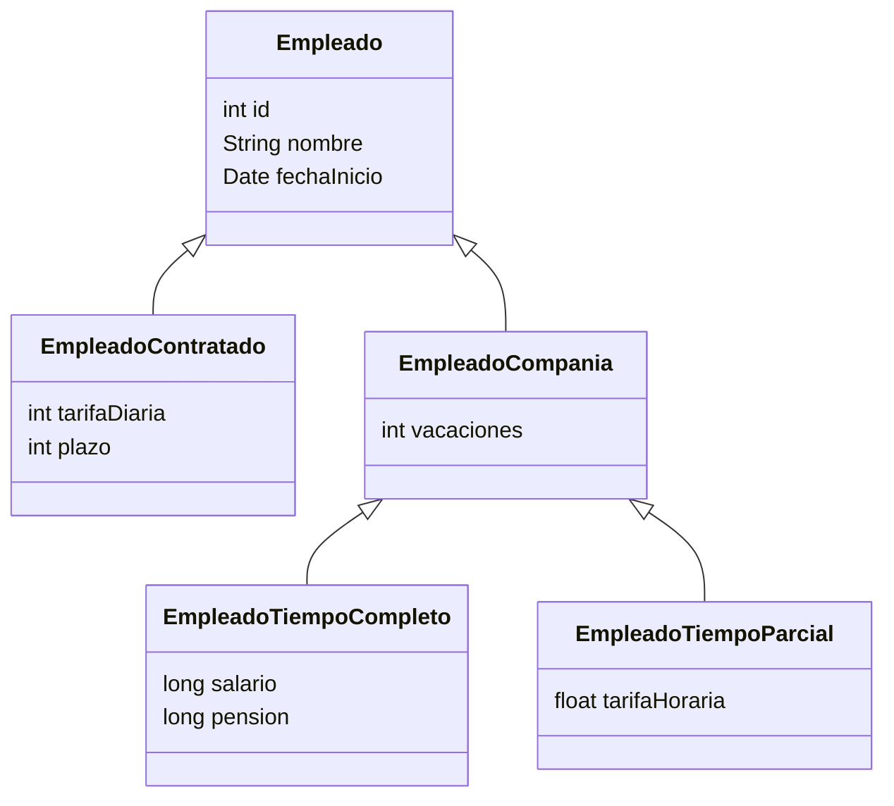

# 1. Jerarquías de Clases

El primer y más obvio lugar para comenzar a hablar sobre herencia es en el modelo de objetos de Java. Después de todo, las entidades son objetos y deberían poder heredar estado y comportamiento de otras entidades. Esto no solo se espera, sino que también es esencial para el desarrollo de aplicaciones orientadas a objetos.

### ¿Qué significa que una entidad herede estado de su superclase?

 <aside style="border: 2px solid rgb(249, 180, 254); padding: 10px; border-radius: 5px;"> 
Cuando una entidad hereda estado de su superclase, significa que cuando se instancia una entidad de la subclase, <span style="color:rgb(249, 180, 254)">tiene su propia versión o copia tanto de su estado localmente definido como de su estado heredado</span>. Todo esto es persistente. Esta premisa abre la pregunta sobre qué sucede cuando una entidad hereda de algo que no es otra entidad. Es decir:
</aside>

- ¿A qué clases se le permite a una entidad heredar?
    
- ¿Qué sucede cuando una entidad hereda de una clase no considerada entidad?
    

Para comprender esto mejor, consideremos la siguiente jerarquía de clases:

```java
public class Empleado {
    private int id;
    private String nombre;
    private Date fechaInicio;
    // ...
}

public class EmpleadoContratado extends Empleado {
    private int tarifaDiaria;
    private int plazo;
    // ...
}

public class EmpleadoCompania extends Empleado {
    private int vacaciones;
    // ...
}

public class EmpleadoTiempoCompleto extends EmpleadoCompania {
    private long salario;
    private long pension;
    // ...
}

public class EmpleadoTiempoParcial extends EmpleadoCompania {
    private float tarifaHoraria;
    // ...
}
```

El diagrama de clases sería el siguiente:



En un modelo de objetos, las jerarquías de clases pueden implementarse de varias maneras, algunas de las cuales incluyen clases que no son entidades.

### Tipos de jerarquías

- <span style="color:rgb(226, 173, 80)"><b>Jerarquía de clases general:</b></span> Un conjunto de varias clases de Java que se extienden en un árbol.
    
- <span style="color:rgb(226, 173, 80)"><b>Jerarquía de entidades:</b></span> Un árbol que consiste en clases de entidades persistentes intercaladas con clases que no son entidades. Su raíz es la primera clase de entidad en la jerarquía.
    

---

## 1. @MappedSuperclass

[Referencia: API de Persistencia de Jakarta](https://jakarta.ee/specifications/persistence/3.2/apidocs/jakarta.persistence/jakarta/persistence/mappedsuperclass)

La API de Persistencia de Jakarta define un tipo especial de clase denominada **superclase mapeada** mediante la anotación `@MappedSuperclass`. Este mecanismo es muy útil para definir una clase base en la que almacenar estado y comportamiento compartidos que luego serán heredados por las entidades, sin que la superclase en sí misma se mapee como una entidad persistente.

---

### 1.1 Características Principales

- **No es una clase persistente:**  
    La superclase mapeada **no se mapea a una tabla en la base de datos**. Esto significa que, a diferencia de las entidades, no se persistirá directamente ni podrá ser instanciada o consultada.
    
- **No puede actuar como una entidad:**  
    Al no ser una entidad, **no se puede utilizar en consultas JPQL** ni en relaciones como destino. Por ejemplo, **no se puede usar como objetivo de una asociación `@OneToMany` o `@ManyToOne`**.
    
- **No se puede consultar**.
    
    
- **No puede ser el objetivo de una relación**.
    
    
- **Restricción de anotaciones:**  
    Anotaciones como `@Table` **no están permitidas** en una superclase mapeada, ya que el estado definido en ella se aplica **únicamente a las subclases de entidad**.
    

---

### 1.2 Comparación con Clases Abstractas

- **Clases Abstractas:**  
    Se utilizan para definir comportamiento y atributos comunes que solo tienen sentido en relación con sus subclases concretas. Una clase abstracta no se espera que se instancie directamente.
    
- **Superclases Mapeadas:**  
    Cumplen una función similar en cuanto a compartir estado y comportamiento, pero **su propósito es exclusivamente heredar mapeos a las entidades**. No se pueden instanciar ni consultar por sí solas.
    

> **Nota:**  
> "Las superclases mapeadas se pueden comparar con las entidades de alguna manera similar a como se compara una clase abstracta con una clase concreta; pueden contener estado y comportamiento, pero simplemente no se pueden instanciar como entidades persistentes."

---

### 1.3 Buenas Prácticas

- **Definir como abstractas:**  
    Aunque técnicamente pueden definirse como concretas o abstractas, es una buena práctica marcar las superclases mapeadas como **clases Java abstractas reales**, ya que no existen casos de uso comunes en los que se desee instanciar una superclase mapeada.
    
- **Uso adecuado:**  
    Si se necesita que la clase se consulte o que actúe como destino de una relación, lo más apropiado es definirla como **entidad de primera clase** en lugar de como superclase mapeada.
    
- **Aplicación de reglas de asignación:**  
    Todas las reglas de asignación predeterminadas que se aplican a las entidades se extienden al estado (tanto atributos básicos como de relación) definido en las superclases mapeadas.
    

> **Ventaja principal:**  
> Permite definir un estado compartido parcial que **no debería accederse por sí mismo** sin el estado adicional que aportan las subclases de entidad.

---

###  1.4 Decisión: ¿Entidad o Superclase Mapeada?

- **Usar superclase mapeada:**  
    Cuando solo se necesita compartir estado y comportamiento entre entidades sin que la clase base sea consultable o participe en relaciones.
    
- **Usar entidad de primera clase:**  
    Si se requiere que se puedan realizar consultas o que la clase actúe como destino en relaciones, entonces es preferible definirla como entidad.
    

> **Ejemplo de aplicación:**  
> "Volviendo a la relación anterior, podríamos concebir tratar la clase `EmpleadoCompania` como una superclase mapeada en lugar de una entidad. Define un estado compartido, pero quizás no tengamos ninguna razón para realizar consultas sobre ella."

---

### Ejemplo Práctico

A continuación, se muestra un ejemplo completo de cómo se mapearía una jerarquía de clases utilizando una superclase mapeada:

```java
@Entity
public class Empleado {
    @Id 
    private int id;
    private String nombre;
    
    @Temporal(TemporalType.DATE)
    @Column(name="fechaInicio")
    private Date fechaInicio;
    // ...
}

@Entity
public class EmpleadoContratado extends Empleado {
    @Column(name="tarifaDia")
    private int tarifaDiaria;
    private int plazo;
    // ...
}

@MappedSuperclass
public abstract class EmpleadoCompania extends Empleado {
    private int vacaciones;
    // ...
}

@Entity
public class EmpleadoTiempoCompleto extends EmpleadoCompania {
    private long salario;
    private long pension;
    // ...
}

@Entity
public class EmpleadoTiempoParcial extends EmpleadoCompania {
    @Column(name="tarifaHora")
    private float tarifaHoraria;
    // ...
}

```
- Detalles del ejemplo:
	- **`Empleado`:**  
    Define la entidad base con atributos comunes como `id`, `nombre` y `fechaInicio`.
    
	- **`EmpleadoContratado`:**  
    Extiende de `Empleado` y añade atributos específicos (`tarifaDiaria` y `plazo`).
    
	- **`EmpleadoCompania`:**  
    Se define como **superclase mapeada** (con `@MappedSuperclass`) y aporta el atributo `vacaciones` a sus subclases.  
    **Importante:** No se puede consultar ni instanciar directamente.
    
	- **`EmpleadoTiempoCompleto` y `EmpleadoTiempoParcial`:**  
    Son entidades concretas que extienden de `EmpleadoCompania`, heredando el estado compartido y agregando atributos propios (`salario`, `pension` y `tarifaHoraria`, respectivamente).
---

## 1.2. Clases Transitorias en la Jerarquía

Las clases en una jerarquía de entidades que no son entidades ni superclases mapeadas se llaman **clases transitorias**.

Cuando una entidad hereda de una clase transitoria, el estado de la clase transitoria **no es persistente**. Es decir, aunque la entidad herede atributos de la clase transitoria, estos no serán gestionados por JPA.

Ejemplo:

```java
public abstract class EntidadConCache {
    private long tiempoCreacion;
    public EntidadConCache() { tiempoCreacion = System.currentTimeMillis(); }
    public long getTiempoCache() {
        return System.currentTimeMillis() - tiempoCreacion;
    }
}

@Entity
public class Empleado extends EntidadConCache {
    public Empleado() { super(); }
    // ...
}
```

---

## 1.3. Clases Abstractas y Concretas

En JPA, las entidades, superclases mapeadas y clases transitorias pueden ser abstractas o concretas en cualquier nivel de la jerarquía.

Una **entidad abstracta** no puede instanciarse, pero su estado y comportamiento persistente pueden ser heredados por subclases concretas. También pueden contener metadatos de asignación de herencia.

En nuestro ejemplo, podríamos hacer que `Empleado` sea abstracta para evitar la creación de instancias incompletas.

```java
@Entity
@Inheritance(strategy = InheritanceType.JOINED)
public abstract class Empleado {
    @Id private int id;
    private String nombre;
    private Date fechaInicio;
    // ...
}
```

De esta forma, solo se pueden instanciar subclases concretas como `EmpleadoTiempoCompleto` o `EmpleadoTiempoParcial`.