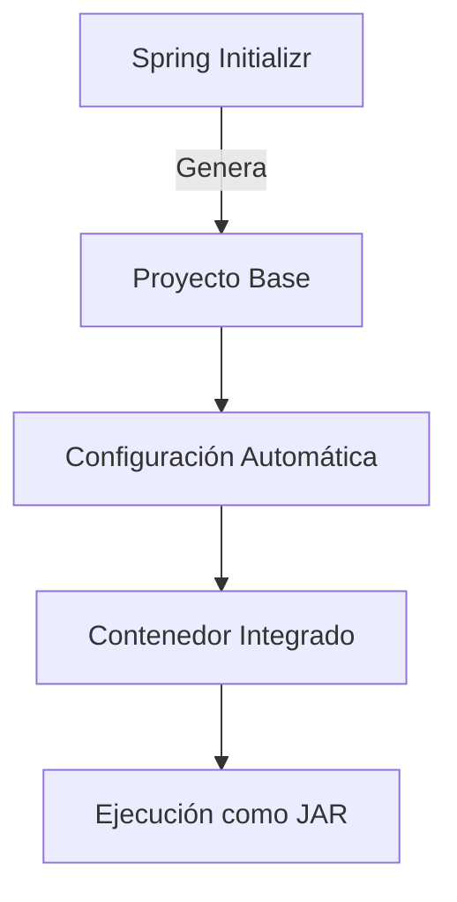

# 1. Introducción a Spring Boot

Spring Boot es un **framework de desarrollo** que simplifica la creación de aplicaciones basadas en Spring. Su objetivo principal es eliminar la necesidad de configuración repetitiva, permitiendo a los desarrolladores centrarse en la lógica de negocio.

### Herramientas para Crear una Aplicación Spring Boot

|Herramienta|Descripción|
|---|---|
|**Spring Initializr**|Generador en línea para proyectos Spring Boot. Disponible en [start.spring.io](https://start.spring.io/).|
|**Spring Tool Suite (STS)**|Extensión para IDEs como Eclipse, VSCode o Theia con soporte integrado para Spring.|
|**IntelliJ IDEA Ultimate**|Versión comercial de IntelliJ con soporte nativo para Spring Boot.|
|**NetBeans**|Requiere complementos de terceros (ej: NB Spring Boot).|

---

# 2. ¿Qué es Spring Boot?

Framework que acelera el desarrollo de aplicaciones Spring mediante:

- **Starters**: Dependencias preconfiguradas.
    
- **Autoconfiguración**: Configuración automática basada en el classpath.
    
- **Gestión de Configuración**: Archivos `application.properties` o `application.yml`.
    
- **Spring Boot Actuator**: Monitoreo y métricas en producción.
    
- **Contenedor Integrado**: Ejecución como JAR con servlets embebidos (Tomcat, Jetty).
    

## 2.1. Spring Boot Starters

Módulos que agrupan dependencias comunes. Ejemplo:

```xml
<dependencies>
    <dependency>
        <groupId>org.springframework.boot</groupId>
        <artifactId>spring-boot-starter-data-jpa</artifactId>
    </dependency>
    <dependency>
        <groupId>org.springframework.boot</groupId>
        <artifactId>spring-boot-starter-web</artifactId>
    </dependency>
</dependencies>
```

- **Ejemplos de Starters**:
    
    - `spring-boot-starter-web`: Aplicaciones web/REST.
        
    - `spring-boot-starter-test`: Pruebas unitarias.
        
    - `spring-boot-starter-thymeleaf`: Motor de plantillas.
        

## 2.2. Autoconfiguración

Spring Boot detecta automáticamente componentes basados en:

- **Presencia de clases en el classpath**.
    
- **Existencia de beans definidos por el usuario**.
    
- **Propiedades del sistema o archivos de configuración**.
    

**Ejemplo**: Si existe `spring-webmvc` en el classpath, Spring Boot configura automáticamente `DispatcherServlet`.

## 2.3. Gestión de Configuración

- **Archivos de Configuración**:
    
    - `application.properties`: Formato clave-valor.
        
    - `application.yml`: Estructura jerárquica (YAML).
        
- **Perfiles**: Permiten configuraciones específicas para entornos (ej: `application-dev.properties`, `application-prod.properties`).
    

## 2.4. Spring Boot Actuator

Habilita endpoints para monitoreo en producción:

- `/health`: Estado de la aplicación.
    
- `/beans`: Lista de beans registrados.
    
- `/mappings`: Rutas de la aplicación.
    
- `/env`: Variables de entorno.
    

## 2.5. Contenedor de Servlet Integrado

- **Ejecución como JAR**: No requiere servidor externo.
    
- **Servidores soportados**: Tomcat (por defecto), Jetty, Undertow.
    

---

# 3. Primera Aplicación Spring Boot

## 3.1. Usando Spring Initializr

**Pasos**:

1. Acceder a [start.spring.io](https://start.spring.io/).
    
2. Configurar proyecto:
    
    - **Project**: Maven.
        
    - **Spring Boot**: Última versión estable (ej: 3.2.4).
        
    - **Metadata**:
        
        - Group: `local.sanclemente.ad`
            
        - Artifact: `springboot-basic`
            
        - Packaging: JAR.
            
        - Java: Versión 21.
            
3. **Dependencias**:
    
    - `Spring Web`: Para aplicaciones web/REST.
        
4. **Generar proyecto**: Descargar ZIP e importar al IDE.
    

### Estructura del Proyecto Generado

```
src/
├── main/
│   ├── java/
│   │   └── local/sanclemente/ad/demo/
│   │       └── SpringbootBasicApplication.java  // Clase principal
│   └── resources/
│       ├── static/      // Archivos estáticos (CSS, JS)
│       ├── templates/   // Plantillas (Thymeleaf)
│       └── application.properties  // Configuración
pom.xml                 // Dependencias Maven
```


## 3.2. Spring Tool Suite (STS)

- **Pasos**:
    
    1. Instalar STS como extensión del IDE.
        
    2. Crear proyecto: `File > New > Spring Starter Project`.
        
    3. Configurar dependencias y metadata.
        

## 3.3. IntelliJ IDEA Ultimate

- **Requisito**: Versión Ultimate (gratuita para estudiantes).
    
- **Pasos**:
    
    1. `File > New > Project > Spring Initializr`.
        
    2. Seleccionar dependencias y configurar proyecto.
        

## 3.4. NetBeans

- **Complemento**: NB Spring Boot ([enlace](https://github.com/AlexFalappa/nbspringboot)).
    
- **Funcionalidad**: Creación de proyectos Spring Boot desde el IDE.
    

---

# 4. Ejecutar la Aplicación

**Métodos**:

1. **IDE**: Ejecutar la clase principal (`@SpringBootApplication`).
    
2. **Maven**:
	 ```bash
    mvn spring-boot:run
	```
    
3. **Línea de comandos**:
    
    ```bash
    java -jar nombre-del-proyecto.jar
	```
    

---

# 5. Notas Importantes

- **Versiones de Spring Boot**: Usar siempre la última versión estable. Las versiones SNAPSHOT pueden ser inestables.
    
- **IntelliJ Community**: No soporta Spring Boot de forma nativa. Usar Spring Initializr e importar como proyecto Maven/Gradle.
    
- **Configuración Avanzada**: Personalizar propiedades en `application.properties` (ej: `server.port=8081`).
    

---

# 6. Ejemplo de Aplicación Web Básica

Crear un controlador para servir una página HTML:

```java
@RestController
public class HelloController {
    
    @GetMapping("/")
    public String home() {
        return "¡Hola desde Spring Boot!";
    }
}
```
- **Resultado**: Acceder a `http://localhost:8080/` muestra el mensaje.
    

---

## Diagrama de Flujo de Spring Boot

