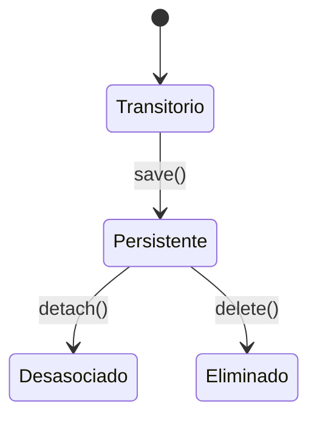

🎯 _Guía completa para aprender Hibernate, sus características, configuración y optimización._

---

## **1️⃣ Introducción a Hibernate**

### 🌟 ¿Qué es Hibernate?

**Hibernate** es un framework de mapeo objeto-relacional (**ORM**) que permite a los desarrolladores trabajar con bases de datos utilizando objetos Java en lugar de sentencias SQL.

### 🎯 **Objetivo**:

1. Abstraer el acceso a la base de datos.
2. Reducir el esfuerzo manual al escribir consultas SQL.
3. Gestionar automáticamente las relaciones y transacciones entre entidades.

---

### 🛠️ **Ventajas**:

4. ✅ **Menos código**: Hibernate genera automáticamente SQL a partir de las operaciones realizadas sobre objetos.
5. ✅ **Relaciones complejas**: Facilita el manejo de relaciones entre tabla
    1. uno-a-uno
    2. uno-a-muchos
    3. muchos-a-muchos
6. ✅ **Caché integrado**: Mejora el rendimiento al reducir la cantidad de consultas directas a la base de datos.
7. ✅ **Independencia de la base de datos**: El mismo código funciona con múltiples SGBD (MySQL, PostgreSQL, Oracle, etc.).

---

## **2️⃣ Ciclo de Vida de las Entidades**

Las entidades en Hibernate tienen un ciclo de vida que define su relación con la base de datos y el contexto de persistencia.



### 📌 Estados:

8. **Transitorio**:
    
    - La entidad no está asociada a la base de datos ni a una sesión.
        
    - Ejemplo:
        
        ```java
        Usuario usuario = new Usuario(); // Estado transitorio
        ```
        
9. **Persistente**:
    
    - La entidad está sincronizada con la base de datos y gestionada por Hibernate.
        
    - Ejemplo:
        
        ```java
        session.save(usuario); // Estado persistente
        ```
        
10. **Desasociado (Detached)**:
    
    - La sesión que gestionaba la entidad ha finalizado, pero los datos existen en la base de datos.
        
    - Ejemplo:
        
        ```java
        session.evict(usuario); // Desasocia la entidad de la sesión
        ```
        
11. **Eliminado**:
    
    - La entidad está marcada para eliminación en la base de datos.
    - Ejemplo:

---

## **3️⃣ Configuración de Hibernate con Spring Boot**

Hibernate es compatible con **Spring Boot**, lo que simplifica su configuración gracias a las dependencias de inicio y la configuración automática.

### 🔧 **Configuración Básica**

### Dependencias en `pom.xml`:

```xml
<dependency>
    <groupId>org.springframework.boot</groupId>
    <artifactId>spring-boot-starter-data-jpa</artifactId>
</dependency>
<dependency>
    <groupId>com.mysql</groupId>
    <artifactId>mysql-connector-j</artifactId>
    <scope>runtime</scope>
</dependency>
```

### Archivo `application.properties`:

```
spring.datasource.url=jdbc:mysql://localhost:3306/mi_base_datos
spring.datasource.username=root
spring.datasource.password=secret
spring.jpa.hibernate.ddl-auto=update
spring.jpa.show-sql=true
spring.jpa.properties.hibernate.dialect=org.hibernate.dialect.MySQLDialect
```

### Entidad Básica:

```java
@Entity
@Table(name = "usuarios")
public class Usuario {
    @Id
    @GeneratedValue(strategy = GenerationType.IDENTITY)
    private Long id;

    @Column(nullable = false)
    private String nombre;
}
```

---

## **4️⃣ Mapeo de Relaciones entre Entidades**

Hibernate soporta varios tipos de relaciones que se traducen en claves foráneas y tablas de unión en la base de datos.

### 📌 Relaciones Básicas:

12. **Uno-a-Uno (@OneToOne)**:
    
13. **Uno-a-Muchos (@OneToMany)**:
    
    ```java
    @OneToMany(mappedBy = "usuario", cascade = CascadeType.ALL)
    private List<Orden> ordenes;
    ```
    
14. **Muchos-a-Uno (@ManyToOne)**:
    
    ```java
    @ManyToOne
    @JoinColumn(name = "categoria_id")
    private Categoria categoria;
    ```
    
15. **Muchos-a-Muchos (@ManyToMany)**:
    
    ```java
    @ManyToMany
    @JoinTable(
        name = "usuario_rol",
        joinColumns = @JoinColumn(name = "usuario_id"),
        inverseJoinColumns = @JoinColumn(name = "rol_id")
    )
    private Set<Rol> roles;
    ```
    

---

## **5️⃣ Consultas en Hibernate**

Hibernate admite varios enfoques para realizar consultas.

### 🔍 **Hibernate Query Language (HQL)**:

- Similar a SQL, pero opera sobre **entidades** en lugar de tablas.
    
- Ejemplo:
    
    ```java
    List<Usuario> usuarios = session.createQuery(
        "FROM Usuario WHERE activo = true", Usuario.class
    ).getResultList();
    ```
    

### 🔍 **JPQL**:

- Forma estándar definida por JPA:
    
    ```java
    @Query("SELECT u FROM Usuario u WHERE u.nombre = :nombre")
    List<Usuario> buscarPorNombre(@Param("nombre") String nombre);
    ```
    

### 🔍 **Criteria API**:

- Permite construir consultas programáticamente:
    
    ```java
    CriteriaBuilder builder = entityManager.getCriteriaBuilder();
    CriteriaQuery<Usuario> query = builder.createQuery(Usuario.class);
    Root<Usuario> root = query.from(Usuario.class);
    query.select(root).where(builder.equal(root.get("activo"), true))
    ```
    

---

## **6️⃣ Optimización con EhCache**

### 🚀 **Caché en Hibernate**

16. **Primer Nivel**:
    - Por sesión, habilitado automáticamente.
    - Evita consultas repetitivas dentro de la misma transacción.
17. **Segundo Nivel**:
    - Compartido entre múltiples sesiones.
    - Necesita configuración explícita.

### 🛠️ **Configuración de EhCache**

18. **Dependencias**:
    
    ```xml
    <dependency>
        <groupId>org.ehcache</groupId>
        <artifactId>ehcache</artifactId>
    </dependency>
    ```
    
19. **Archivo `ehcache.xml`**:
    
    ```xml
    <ehcache>
        <cache name="usuarios" maxEntriesLocalHeap="1000" timeToLiveSeconds="3600"/>
    </ehcache>
    ```
    
20. **Anotaciones en Entidades**:
    
    ```java
    @Entity
    @Cache(usage = CacheConcurrencyStrategy.READ_WRITE)
    public class Usuario {
        // ...
    }
    ```
    

---

## **7️⃣ Buenas Prácticas**

21. **Evitar el problema N+1 Queries**:
    
    - Usa `JOIN FETCH` para cargar relaciones necesarias:
        
        ```java
        SELECT u FROM Usuario u JOIN FETCH u.ordenes;
        ```
        
22. **Usar DTOs para consultas complejas**:
    
    - Evita cargar entidades completas si solo necesitas ciertos campos.
23. **Habilitar el Caché de Consultas**:
    
    ```java
    Query query = session.createQuery("FROM Usuario");
    query.setCacheable(true); 
    ```
    
24. **Monitorear el Rendimiento**:
    
    - Usa herramientas como JMX o Spring Boot Actuator para identificar cuellos de botella.

---

## **8️⃣ Conclusión**

Hibernate es una herramienta poderosa que, junto con **JPA** y **Spring Boot**, facilita la construcción de aplicaciones escalables y eficientes. La clave está en:

- Configurar correctamente el framework.
- Optimizar consultas y relaciones.
- Aprovechar técnicas de caché y paginación.