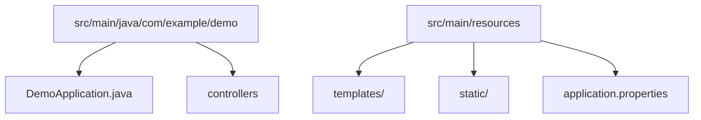
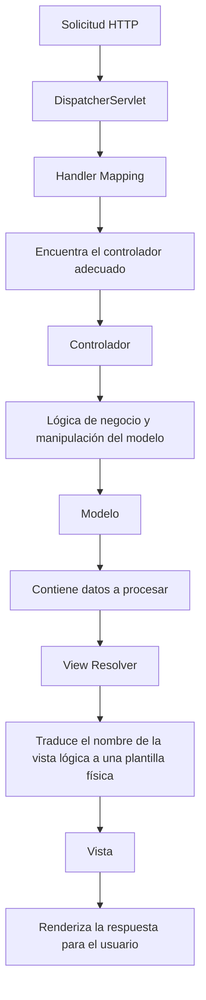

### 🎯 **Objetivo de Spring MVC**

El objetivo principal de Spring MVC es proporcionar un marco modular, flexible y fácilmente escalable para el desarrollo de aplicaciones web. Se basa en dos patrones esenciales:

1. **Front Controller**: Centraliza la gestión de solicitudes HTTP.
2. **Modelo-Vista-Controlador (MVC)**: Separa las responsabilidades para facilitar la mantenibilidad.

### 📌 **Beneficios clave**

- **Simplicidad**: Uso de anotaciones para reducir la configuración.
- **Flexibilidad**: Compatible con múltiples tecnologías de vistas (Thymeleaf, JSP, FreeMarker, etc.).
- **Extensibilidad**: Se integra con Spring Data, Spring Security y Spring Boot para crear soluciones completas.

---

### 🌟 **Comparación entre Spring Framework y Spring Boot**

|**Característica**|**Spring Framework**|**Spring Boot**|
|---|---|---|
|**Configuración**|Compleja, requiere archivos XML.|Configuración automática con anotaciones y dependencias.|
|**Tiempo de desarrollo**|Más largo debido a configuraciones manuales.|Enfoque en el desarrollo rápido de aplicaciones.|
|**Servidor embebido**|No soportado; requiere configurar servidores externos.|Incluye Tomcat, Jetty o Undertow embebidos.|
|**Arranque del proyecto**|Requiere configuraciones manuales de dependencias y estructuras.|Usa [Spring Initializr](https://start.spring.io/) para crear proyectos con configuración básica.|
|**Uso principal**|Proyectos empresariales con requisitos específicos.|Microservicios y aplicaciones modernas cloud-native.|

---

## ⚙️ **Fundamentos y Configuración Inicial**

### 🛠 **Configurar un Proyecto Spring MVC**

1. **Inicialización del Proyecto** Usa [Spring Initializr](https://start.spring.io/) para generar una estructura de proyecto básica.
    - **Dependencias mínimas**:
        - **Spring Web**: Para gestionar solicitudes HTTP.
        - **Thymeleaf**: Motor de plantillas para vistas dinámicas.
        - **Spring Boot DevTools**: Herramienta para reinicio automático en desarrollo.
2. **Estructura generada del proyecto:**



1. **Clase principal del proyecto:**

```java
@SpringBootApplication
public class DemoApplication {
    public static void main(String[] args) {
        SpringApplication.run(DemoApplication.class, args);
    }
}

```

**Explicación de `@SpringBootApplication`**:

- Combina tres anotaciones: `@SpringBootConfiguration`, `@EnableAutoConfiguration` y `@ComponentScan`.
- Configura automáticamente los componentes de Spring.

---

### 🔗 **Flujo Completo de una Solicitud en Spring MVC**

**Diagrama Explicativo del Flujo:**



| **Componente**        | **Función**                                                                                  |
| --------------------- | -------------------------------------------------------------------------------------------- |
| **DispatcherServlet** | Centraliza todas las solicitudes HTTP y coordina la lógica entre los componentes.            |
| **Handler Mapping**   | Busca el controlador que gestionará la solicitud (basado en las rutas definidas).            |
| **Modelo**            | Contiene los datos procesados, enviados desde el controlador hacia la vista.                 |
| **View Resolver**     | Traduce el nombre lógico de la vista (por ejemplo, `home`) en un archivo real (`home.html`). |
|                       |                                                                                              |

---

## 📑 **Controladores y Vistas en Spring MVC**

### ✍️ **Controladores con @Controller**

Un controlador maneja solicitudes HTTP entrantes y devuelve una vista o datos.

### **Ejemplo Avanzado:**

```java
java
CopiarEditar
@Controller
@RequestMapping("/products")
public class ProductController {
    @GetMapping
    public String listProducts(Model model) {
        List<Product> products = productService.findAll();
        model.addAttribute("products", products);
        return "product-list";
    }

    @GetMapping("/{id}")
    public String viewProduct(@PathVariable Long id, Model model) {
        Product product = productService.findById(id);
        model.addAttribute("product", product);
        return "product-detail";
    }
}

```

---

### 🌐 **Vistas con Thymeleaf**

2. **Estructura básica de una plantilla HTML Thymeleaf**:

```html
html
CopiarEditar
<!DOCTYPE html>
<html xmlns:th="<http://www.thymeleaf.org>">
<head>
    <title>Productos</title>
</head>
<body>
    <h1>Lista de Productos</h1>
    <ul>
        <li th:each="product : ${products}">
            <a th:href="@{/products/{id}(id=${product.id})}" th:text="${product.name}"></a>
        </li>
    </ul>
</body>
</html>

```

3. **Reutilización de fragmentos**:

```html
html
CopiarEditar
<!-- Fragmento reutilizable: header.html -->
<div th:fragment="header">
    <h1>Mi Aplicación</h1>
    <nav>
        <a href="/home">Inicio</a>
        <a href="/products">Productos</a>
    </nav>
</div>

```

```html
html
CopiarEditar
<!-- Página principal -->
<div th:replace="header :: header"></div>

```

---

## 🌐 **APIs RESTful con Spring MVC**

### 🚨 **Prácticas Recomendadas para RESTful**

4. **URLs basadas en recursos**:
    - `/api/users` para obtener la lista de usuarios.
    - `/api/users/1` para acceder al usuario con ID 1.
5. **Usar métodos HTTP estándar**:
    - `GET` para lectura.
    - `POST` para creación.
    - `PUT` para actualización.
    - `DELETE` para eliminación.
6. **Devolver códigos HTTP significativos**:
    - `200 OK`: Operación exitosa.
    - `201 Created`: Recurso creado con éxito.
    - `404 Not Found`: Recurso no encontrado.
    - `500 Internal Server Error`: Error en el servidor.

---

## 🔐 **Seguridad Avanzada con Spring Security**

### 🛡️ **Configuración con Roles y Autenticación**

```java
java
CopiarEditar
@EnableWebSecurity
public class SecurityConfig extends WebSecurityConfigurerAdapter {
    @Override
    protected void configure(HttpSecurity http) throws Exception {
        http.csrf().disable() // Deshabilita CSRF (no recomendado en producción).
            .authorizeRequests()
            .antMatchers("/admin/**").hasRole("ADMIN")
            .antMatchers("/user/**").hasAnyRole("USER", "ADMIN")
            .antMatchers("/public/**").permitAll()
            .and().formLogin()
            .and().logout();
    }
}

```

|**Ruta**|**Permiso**|
|---|---|
|`/admin/**`|Solo usuarios con rol `ADMIN`.|
|`/user/**`|Usuarios con rol `USER` o `ADMIN`.|
|`/public/**`|Acceso público.|

---

### 🔑 **Validación y Gestión de Errores**

7. **Validación con `@Valid`**:

```java
java
CopiarEditar
@PostMapping("/users")
public ResponseEntity<?> createUser(@Valid @RequestBody User user) {
    userService.save(user);
    return ResponseEntity.ok(user);
}

```

8. **Manejo global de excepciones**:

```java
java
CopiarEditar
@ControllerAdvice
public class GlobalExceptionHandler {
    @ExceptionHandler(UserNotFoundException.class)
    public ResponseEntity<?> handleUserNotFound(UserNotFoundException ex) {
        return ResponseEntity.status(HttpStatus.NOT_FOUND).body(ex.getMessage());
    }
}

```

---

### 📖 **Conclusiones Finales**

- **Spring MVC** es ideal para aplicaciones web modernas.
- Su flexibilidad, extensibilidad y compatibilidad con herramientas avanzadas lo convierten en una solución completa.
- **Prácticas recomendadas**: Implementa separación de responsabilidades, configura seguridad robusta y utiliza pruebas automatizadas para garantizar estabilidad.