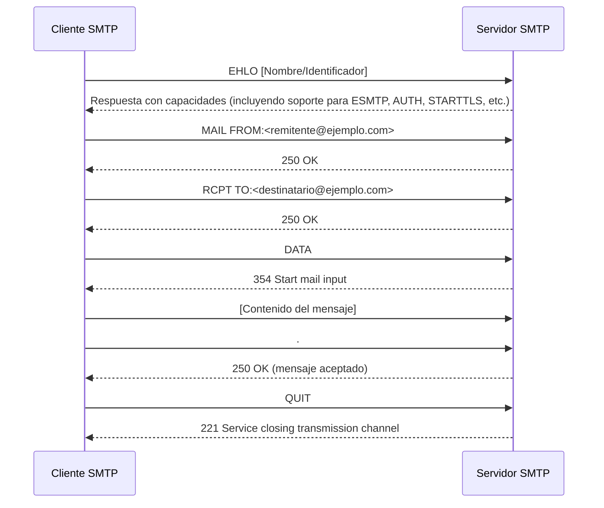
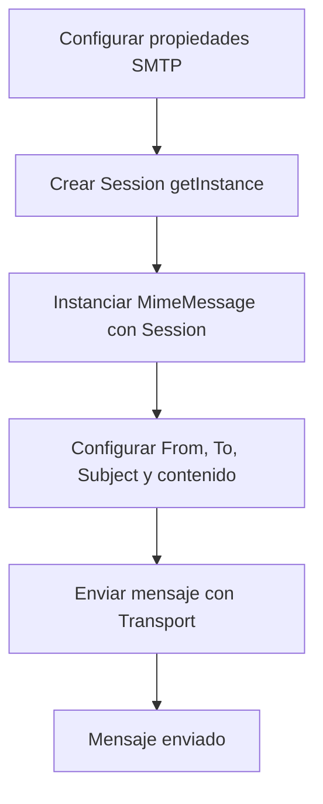

<aside style="border: 2px solid purple; padding: 10px; border-radius: 5px;"> 
Los <b>servicios de red</b> consisten en <u><span style="color:red">aplicaciones que utilizan protocolos para facilitar diversas funciones en un entorno de red</span></u>. Estos protocolos incluyen, pero no se limitan a, SSH, SMTP, DNS, Telnet, FTP, entre otros. A continuación se detallan algunos aspectos relevantes:
</aside>

- <span style="color:rgb(192, 0, 0)"><b>Acceso remoto interactivo:</b></span> 
    Permiten que usuarios y administradores accedan a sistemas de forma remota para ejecutar comandos, administrar configuraciones o realizar tareas de mantenimiento. Ejemplo: **SSH** (Secure Shell) para conexiones seguras.
    
- <span style="color:rgb(192, 0, 0)"><b>Transferencia de archivos:</b></span>
    Protocolos como **FTP** (File Transfer Protocol) facilitan la transferencia de archivos entre equipos, ya sea en redes locales o a través de Internet.
    
    > 🔄 **Nota:** Algunos servicios de transferencia modernos utilizan variantes más seguras como SFTP o FTPS.
    
- <span style="color:rgb(192, 0, 0)"><b>Funciones administrativas críticas:</b></span>  
    Muchos servicios de red permiten realizar tareas esenciales para el funcionamiento de un sistema o red, como la administración remota de servidores, la resolución de nombres de dominio (DNS) o la supervisión del estado de los dispositivos.
    
- <span style="color:rgb(192, 0, 0)"><b>Exposición a Internet:</b></span>  
    Aunque muchos de estos servicios se usan internamente, en ocasiones se exponen a Internet para respaldar funciones empresariales, como el envío de correos electrónicos, el acceso remoto a aplicaciones web o el soporte a usuarios externos.
    
    > ⚠️ **Precaución:** La exposición de estos servicios puede incrementar la superficie de ataque, por lo que se deben aplicar medidas de seguridad adecuadas, como cortafuegos, autenticación robusta y cifrado.
    
- <span style="color:rgb(192, 0, 0)"><b>Configuraciones predeterminadas:</b></span>
    Muchos equipos de red y servidores tienen habilitados ciertos servicios por defecto para facilitar la administración inicial. Esto puede incluir servicios de diagnóstico, transferencia de archivos o incluso servicios de administración remota. Es importante revisarlos y ajustarlos según las políticas de seguridad de la organización.
    

---

# SMTP

<aside style="border: 2px solid orange; padding: 10px; border-radius: 5px;"> 
El <span style="color:blue"><b>Simple Mail Transfer Protocol (SMTP)</b></span> es un protocolo fundamental en la infraestructura del correo electrónico. <u><b>Se encarga de la transmisión de mensajes entre servidores de correo y desde los clientes de correo hacia estos servidores</b></u>. A continuación se explican sus características y funcionamiento en detalle:
</aside>

- **Servidor SMTP:**  
    Un servidor SMTP es una aplicación encargada de recibir, enviar y reenviar correos electrónicos conforme a las normas del protocolo. Entre sus funciones principales destacan:
    
    - **Envío de correos:** Tras recibir la solicitud de envío, el servidor gestiona la conexión y transfiere el mensaje hacia otros servidores o directamente al destinatario.
    - **Recepción y retransmisión:** Aunque el envío es su función primordial, muchos servidores también son responsables de recibir correos de otros servidores y reenviarlos en la red.
    - **Prevención de spam:** Para evitar el envío masivo de correos no deseados, la mayoría de los servidores modernos incorporan mecanismos de autenticación, como **SMTP-Auth** en conjunto con la extensión **ESMTP**. Esto garantiza que solo usuarios autorizados puedan utilizar el servicio para enviar mensajes.
- **Proceso de envío de correo electrónico:**  
    Cuando un usuario redacta un mensaje y pulsa "Enviar", se inicia el siguiente flujo:
    
    1. **Conexión inicial:** El cliente de correo establece una conexión con el servidor SMTP.
    2. **Negociación y autenticación:** Se intercambian comandos e información para identificar y autenticar al usuario.
    3. **Transferencia del mensaje:** El correo se transmite mediante una serie de comandos (ver sección de comandos básicos).
    4. **Finalización de la sesión:** Una vez completada la transmisión, se cierra la conexión de manera ordenada.
- **Extensión ESMTP:**  
    La extensión ESMTP permite funcionalidades adicionales, como mayor capacidad de autenticación y la negociación de parámetros de seguridad (por ejemplo, el uso de STARTTLS para cifrar la conexión). Esta extensión mejora la robustez y seguridad en la comunicación de correos electrónicos.
    

---

## Comandos Básicos de SMTP

Los comandos SMTP son esenciales para la correcta comunicación entre el cliente y el servidor durante el proceso de envío de correos. Cada comando tiene una función específica que guía la transacción. A continuación, se describen en detalle:

| **Comando**                                                    | **Función y Detalles**                                                                                                                                                                                                                                                                                                     | **Código de Respuesta Típico**                                                       | **Ejemplo / Notas**                                                                                    |
| -------------------------------------------------------------- | -------------------------------------------------------------------------------------------------------------------------------------------------------------------------------------------------------------------------------------------------------------------------------------------------------------------------- | ------------------------------------------------------------------------------------ | ------------------------------------------------------------------------------------------------------ |
| <span style="color:rgb(129, 0, 214)"><b>HELO / EHLO</b></span> | - **Función:** Iniciar la conversación entre el cliente y el servidor.  <br>- **Descripción:** El cliente se identifica ante el servidor, enviando su nombre de dominio o dirección IP. Con EHLO, además, se negocian extensiones adicionales, lo que permite al servidor indicar las capacidades soportadas (como ESMTP). | N/A (inicio de sesión)                                                               | 😃 **Nota:** EHLO es la versión extendida y es preferida en configuraciones modernas.                  |
| <span style="color:rgb(129, 0, 214)"><b>MAIL FROM</b></span>   | - **Función:** Especificar la dirección de correo del remitente.  <br>- **Descripción:** Indica que se va a iniciar una nueva transacción de envío de correo. El servidor, al recibir este comando, se prepara para recibir más información.                                                                               | **250 OK**                                                                           | 📧 El comando envía la dirección del remitente: `MAIL FROM:<usuario@ejemplo.com>`.                     |
| <span style="color:rgb(129, 0, 214)"><b>RCPT TO</b></span>     | - **Función:** Definir la dirección del destinatario.  <br>- **Descripción:** Puede utilizarse varias veces en una misma sesión para enviar el mensaje a múltiples destinatarios. Cada destinatario se verifica de manera independiente.                                                                                   | **250 OK**                                                                           | 👥 Se pueden agregar varios destinatarios enviando múltiples comandos RCPT TO, uno por cada dirección. |
| <span style="color:rgb(129, 0, 214)"><b>DATA</b></span>        | - **Función:** Iniciar la transferencia del contenido del mensaje.  <br>- **Descripción:** Después de emitir el comando DATA, el servidor responde con un código que indica que está listo para recibir el cuerpo del mensaje. El mensaje se termina con un punto (.) en una línea aislada para señalar su fin.            | **354 Start mail input; end with <CRLF>.<CRLF>** luego **250 OK** cuando es aceptado | 📝 Es crucial que el mensaje finalice correctamente para evitar errores en la transmisión.             |
| <span style="color:rgb(129, 0, 214)"><b>QUIT</b></span>        | - **Función:** Finalizar la sesión SMTP de forma ordenada.  <br>- **Descripción:** Indica al servidor que cierre la conexión una vez completada la transacción.                                                                                                                                                            | **221 Service closing transmission channel**                                         | 🔚 Permite que el servidor libere recursos y cierre la conexión de manera controlada.                  |
| <span style="color:rgb(129, 0, 214)"><b>RSET</b></span>        | - **Función:** Reiniciar la transacción actual.  <br>- **Descripción:** Se utiliza para abortar el envío de un correo en curso sin cerrar la conexión, reseteando el estado interno del servidor. Útil en casos de error, como la introducción de datos erróneos en algún comando.                                         | N/A (Reinicia el estado)                                                             | 🔄 Ideal para corregir errores sin necesidad de cerrar la sesión y reiniciar toda la conexión.         |

> **Otros Comandos y Extensiones:**
> - **AUTH:** Permite la autenticación de usuarios, asegurando que solo usuarios autorizados puedan enviar correos.
> - **STARTTLS:** Inicia la encriptación de la sesión, protegiendo la transmisión de datos sensibles mediante TLS (Transport Layer Security).

## Diagrama de Flujo de una Sesión SMTP


Este diagrama ilustra el proceso típico de envío de un correo mediante SMTP, mostrando cómo se intercambian los comandos y respuestas.

---

###  POP e IMAP vs SMTP

Si bien SMTP es el único protocolo utilizado para el envío de mensajes entre servidores de correo (o desde un cliente a un servidor), existen otros dos protocolos clave para la recepción de correos:

| **Protocolo**         | **Función Principal**                             | **Uso Típico**                                             | **Ventajas**                                                      |
| --------------------- | ------------------------------------------------- | ---------------------------------------------------------- | ----------------------------------------------------------------- |
| **SMTP**              | Envío y retransmisión de correos                  | Transmisión entre servidores y desde clientes a servidores | Permite comunicación entre servidores desconocidos                |
| **POP**<br>(antiguo)  | Descarga de correos desde el servidor             | Acceso desde un solo dispositivo                           | Menor uso de recursos del servidor; proceso sencillo              |
| **IMAP**<br>(moderno) | Acceso y gestión remota de correos en el servidor | Sincronización entre múltiples dispositivos                | Acceso simultáneo, organización centralizada y mayor flexibilidad |

> 📌 **Resumen:**
> - **SMTP** se encarga de enviar correos, mientras que **POP** e **IMAP** se encargan de recibir y gestionar esos correos.
> - POP es ideal para accesos únicos y descargas locales, y IMAP es preferido en entornos donde se utilizan varios dispositivos.

![[Pasted image 20250218112557.png]]

---
## Default Email Ports

<aside style="border: 2px solid orange; padding: 10px; border-radius: 5px;"> 
Los <b>puertos de correo electrónico</b> son puntos finales de comunicación que <span style="color:orange"><u>definen cómo debe transmitirse un mensaje</u></span>, determinando si este se envía en texto plano o si se cifra para intercambiarlo de forma segura. Para establecer una conexión entre un cliente de correo electrónico y un servidor, se requiere conocer la dirección IP del servidor y un número de puerto. Estos atributos son asignados por la <b>IANA (Internet Assigned Numbers Authority)</b>.
</aside>

**<u>Cada protocolo utiliza sus propios números de puerto para conectar</u>** y, a su vez, **cada puerto soporta un tipo distinto de cifrado**. En el caso del protocolo SMTP, se tienen cuatro puertos principales, cada uno con un método de encriptación específico:

| **Puerto** | **Descripción**                                                                                                             | **Tipo de Cifrado / Notas**                                                                                                                                                     |
| ---------- | --------------------------------------------------------------------------------------------------------------------------- | ------------------------------------------------------------------------------------------------------------------------------------------------------------------------------- |
| **25**     | Se utiliza para enviar mensajes en texto plano. En algunos casos, si el servidor lo soporta, se puede cifrar con TLS.       | ⚠️ Muchos proveedores de servicios de Internet lo bloquean, ya que representa un riesgo de seguridad al no cifrar los mensajes de forma predeterminada.                         |
| **2525**   | Funciona como una <span style="color:rgb(0, 112, 192)">alternativa al puerto 25 para SMTP</span>.                           | Puede cifrarse usando TLS. Es comúnmente utilizado cuando el puerto 25 está restringido o bloqueado.                                                                            |
| **587**    | Puerto registrado por IANA como el puerto SMTP seguro. Requiere una conexión TLS explícita para establecer la comunicación. | Si el servidor de correo no soporta TLS, el mensaje se enviará en texto plano. Se utiliza principalmente para el envío seguro de mensajes.                                      |
| **465**    | Opera mediante una conexión SSL implícita.                                                                                  | La operación se aborta si el servidor no soporta conexiones SSL. Es importante tener en cuenta que SSL ha sido mayormente reemplazado por TLS en términos de seguridad moderna. |

> 💡 **Consejo:**  
> Siempre es recomendable utilizar puertos que aseguren la transmisión encriptada para evitar que la información sensible sea interceptada.

---

## Java Mail API
<aside style="border: 2px solid blue; padding: 10px; border-radius: 5px;"> 
<b>JavaMail</b>, actualmente conocido como <span style="color:blue"><b>Jakarta Mail</b></span>, es una API que permite enviar y recibir correos electrónicos a través de los protocolos SMTP, POP3 e IMAP. Es la opción más popular y soporta tanto la autenticación TLS como SSL.
</aside>
<br>
<aside style="border: 2px solid purple; padding: 10px; border-radius: 5px;"> 
Además, se destaca <b>Angus Mail</b>, un programa desarrollado por Eclipse que sigue las reglas especificadas por la API de Jakarta Mail. Para integrarlo en tu proyecto, puedes agregar el archivo `angus-mail.jar` desde el repositorio Maven utilizando la siguiente dependencia:
</aside>

```xml
<dependencies>
  <dependency>
    <groupId>org.eclipse.angus</groupId>
    <artifactId>angus-mail</artifactId>
    <version>2.0.3</version>
  </dependency>
</dependencies>

```

> 🚀 **Nota:**  
> Tanto JavaMail como Jakarta Mail representan el mismo software, solo difiere la denominación actualizada.

---

## Classes and Methods

Elementos básicos de **Angus Mail** que se necesitan conocer para construir y enviar mensajes de correo electrónico.
### Session

- **Descripción:**  
    La clase `Session` actúa como **fábrica de conexiones** para la API de Jakarta Mail. Es un objeto multi-hilo que recopila propiedades y configuraciones predeterminadas, y se encarga de la configuración y autenticación.
    
- **Métodos para obtener una instancia:**
    
    - `getDefaultInstance()`: Retorna la sesión por defecto.
    - `getInstance()`: Retorna una nueva instancia de sesión.

### Message y MimeMessage

- **Message:**  
    Es una clase abstracta que define la estructura de un mensaje. Para crear un mensaje concreto, se utiliza una de sus subclases.
    
- **MimeMessage:**  
    Es la subclase utilizada para mensajes de correo que cumplen con los estándares **RFC 822** y **MIME**.  
    **Métodos comunes en MimeMessage:**
    
    - `setFrom(Address address)`: Establece el campo "From".
    - `setRecipients(Message.RecipientType type, String addresses)`: Define el tipo de destinatario y las direcciones. Los tipos de destinatario definidos son:
        - `TO` (destinatario principal)
        - `CC` (copia)
        - `BCC` (copia oculta)
    - `setSubject(String subject)`: Define el asunto del correo.
    - `setText(String text)`: Asigna el contenido del mensaje usando el tipo MIME `text/plain`.
    - `setContent(Object message, String contentType)`: Asigna el contenido del mensaje utilizando el tipo MIME `text/html`.

### Otras Clases Importantes

- **Address:**  
    Clase abstracta que modela las direcciones de correo (para los campos "To" y "From"). Generalmente se utiliza la subclase `jakarta.mail.internet.InternetAddress` para representar direcciones de correo de Internet.
    
- **Authenticator:**  
    Clase abstracta que se utiliza para gestionar la autenticación en el acceso a los recursos del servidor de correo. Su subclase `PasswordAuthentication` es la más utilizada.
    
- **Transport:**  
    Clase abstracta que utiliza el protocolo SMTP para enviar y transportar mensajes de correo electrónico.
    

### Pasos para Enviar un Correo usando Angus Mail

1. **Configurar los detalles del servidor SMTP**  
    Se utilizan las propiedades de Java (`Properties`) para definir los parámetros del servidor.
2. **Crear un objeto Session**  
    Se obtiene la sesión mediante el método `getInstance()`.
3. **Componer el mensaje**
    - Instanciar un objeto `MimeMessage` pasando la sesión creada.
    - Establecer los campos **From**, **To** y **Subject**.
    - Utilizar el método `setText()` para asignar el contenido del correo.
4. **Enviar el mensaje**  
    Se utiliza la clase `Transport` para enviar el mensaje.

> 🔄 **Diagrama de Flujo para Envío de Correo:**


---

## Properties
<aside style="border: 2px solid deeppink; padding: 10px; border-radius: 5px;"> 
En las aplicaciones Java, las propiedades <b><u>se utilizan para almacenar parámetros simples en forma de pares clave-valor</u></b>, separados del código compilado. Los archivos de propiedades tienen la extensión <span style="color:rgb(255, 0, 0)">`.properties`</span> y son ideales para almacenar configuraciones, datos de internacionalización y localización.
</aside>


### Creación y Uso de un Archivo de Propiedades

Cada línea de un archivo `.properties` normalmente almacena una sola propiedad. Por ejemplo, un archivo para configurar un servidor SMTP puede tener el siguiente contenido:

```properties
mail.smtp.host=smtp.gmail.com
mail.smtp.port=587
mail.smtp.auth=true
mail.smtp.starttls.enable=true
```

> **Ruta en un Proyecto Maven:**  
> El archivo se ubica en: `src/main/resources`

### Ejemplo de Creación de Propiedades en Código Java (<span style="color:rgb(255, 0, 0)">desaconsejado</span>)

```java
Properties prop = new Properties();
prop.put("mail.smtp.host", "smtp.gmail.com");
prop.put("mail.smtp.port", "587");
prop.put("mail.smtp.auth", "true");
prop.put("mail.smtp.starttls.enable", "true"); // TLS habilitado
```
### Acceso a un Archivo de Propiedades en Java

```java
try (InputStream input = new FileInputStream("src/main/resources/smtp.properties")) {
    Properties prop = new Properties();
    // Cargar el archivo de propiedades
    prop.load(input);
    // Imprimir valores de las propiedades
    System.out.println(prop.getProperty("mail.smtp.host"));
    System.out.println(prop.getProperty("mail.smtp.port"));
    System.out.println(prop.getProperty("mail.smtp.auth"));
    System.out.println(prop.getProperty("mail.smtp.starttls.enable"));
} catch (IOException ex) {
    ex.printStackTrace();
}
```

> 📝 **Propiedades Comunes para SMTP:**
> - `mail.smtp.host`: Host del servidor SMTP.
> - `mail.smtp.port`: Puerto de conexión.
> - `mail.smtp.auth`: Indica si se requiere autenticación.
> - `mail.smtp.starttls.enable`: Indica si TLS está habilitado.

---

## Seguridad en la Transmisión de Correos

La mayoría de los servidores SMTP requieren algún tipo de autenticación para evitar el envío de correos no autorizados. Como por ejemplo:

- **SSL (Secure Socket Layer):**  
    Protocolo antiguo, en desuso en favor de TLS.
    
- **TLS (Transport Layer Security):**  
    Protocolo moderno basado en SSLv3 que ofrece:
    
    - **Confidencialidad:** Oculta el contenido de los mensajes.
    - **Integridad:** Detecta modificaciones o manipulaciones en los mensajes.
    - **Autenticación:** Verifica la identidad del remitente.

Además, TLS es capaz de detectar mensajes faltantes o duplicados.

### Uso de PasswordAuthentication

Para almacenar las credenciales del usuario se utiliza la clase `PasswordAuthentication`. Un ejemplo de implementación en un bloque anónimo de `Authenticator` es:

```java
Authenticator auth = new Authenticator() {
    @Override
    protected PasswordAuthentication getPasswordAuthentication() {
        return new PasswordAuthentication(email, password);
    }
};
Session session = Session.getInstance(props, auth);

```
---
## Mailslurper SMTP Server

**MailSlurper** es un servidor de correo SMTP completamente gratuito y de código abierto, diseñado para pruebas durante el desarrollo de software. Es ideal para desarrolladores individuales o equipos pequeños que necesitan testear funcionalidades de correo sin el riesgo o la complejidad de configurar un servidor de correo completo.

### Características de MailSlurper

- **Fácil configuración:** Se puede instalar y configurar rápidamente.
- **Ideal para testing:** Permite probar el envío y recepción de correos sin afectar sistemas en producción.
- **Gratuito y de código abierto:** Sin costes asociados y con la posibilidad de personalización.

#### Ejemplo de Uso con MailSlurper

El siguiente ejemplo muestra cómo enviar un correo utilizando MailSlurper en un entorno Java:
```java
import jakarta.mail.*;
import jakarta.mail.internet.InternetAddress;
import jakarta.mail.internet.MimeMessage;
import java.io.UnsupportedEncodingException;
import java.util.Properties;

public class SendEmailMailslurper {
    public static void main(String[] args) {
        final String username = "user";
        final String password = "user";
        String sender = "user.testing@yopmail.com";
        String receiver = "someone@gmail.com";
        
        // Configuración de propiedades SMTP
        Properties props = new Properties();
        props.put("mail.smtp.auth", "true");
        props.put("mail.smtp.starttls.enable", "true");
        props.put("mail.smtp.host", "localhost");
        props.put("mail.smtp.port", "2500");
        
        // Creación de la sesión con autenticación
        Session session = Session.getInstance(props, new jakarta.mail.Authenticator() {
            @Override
            protected PasswordAuthentication getPasswordAuthentication() {
                return new PasswordAuthentication(username, password);
            }
        });
        
        try {
            // Composición del mensaje
            Message message = new MimeMessage(session);
            message.setFrom(new InternetAddress(sender, "Name1 Surnames1"));
            message.setRecipient(Message.RecipientType.TO, new InternetAddress(receiver, "Name2 Surnames2"));
            message.setSubject("Hello from Java");
            message.setText("Email sent from Java app and captured by Mailslurper.");
            
            // Envío del mensaje
            Transport.send(message);
            System.out.println("Email sent.");
        } catch (MessagingException e) {
            e.printStackTrace();
            System.out.println("Error sending mail.");
        } catch (UnsupportedEncodingException e) {
            throw new RuntimeException(e);
        }
    }
}

```
> 📬 **Resumen del Ejemplo:**
> 
> 1. Se configuran las propiedades del servidor SMTP.
> 2. Se crea la sesión con autenticación.
> 3. Se compone el mensaje con los campos **From**, **To**, **Subject** y el contenido del correo.
> 4. Se envía el mensaje utilizando la clase `Transport`.
# Gmail SMTP Server

Este apartado describe la configuración y requerimientos para utilizar el servidor SMTP de Gmail.

| **Parámetro**                                     | **Valor / Descripción**                                                                                                                                                                                                                                                   |
| ------------------------------------------------- | ------------------------------------------------------------------------------------------------------------------------------------------------------------------------------------------------------------------------------------------------------------------------- |
| **Dirección del servidor SMTP**                   | `smtp.gmail.com`                                                                                                                                                                                                                                                          |
| **Uso de autenticación**                          | Sí. Es necesario autenticar con tu cuenta de Gmail.                                                                                                                                                                                                                       |
| **Conexión segura**                               | Basada en TLS/SSL, según la configuración de tu cliente de correo o plugin SMTP del sitio web.                                                                                                                                                                            |
| **Nombre de usuario SMTP**                        | Tu cuenta de Gmail (ejemplo: `xxxx@gmail.com`)                                                                                                                                                                                                                            |
| **Contraseña SMTP**                               | Tu contraseña de Gmail. Recuerda que, para enviar correos a través del servidor SMTP de Gmail, debes:  <br>• Permitir "Aplicaciones menos seguras" en tu cuenta de Gmail o  <br>• Generar una "Contraseña de Aplicación" si tienes habilitada la verificación en 2 pasos. |
| **Puertos SMTP de Gmail**                         | - **465 (SSL):** Utiliza una conexión SSL implícita.  <br>- **587 (TLS):** Requiere una conexión TLS explícita.                                                                                                                                                           |
| **Requisito básico**                              | Es necesario disponer de una cuenta de Gmail para utilizar el servidor SMTP de Gmail.                                                                                                                                                                                     |
| **Aviso Importante (a partir del otoño de 2024)** | Las aplicaciones menos seguras, aplicaciones de terceros o dispositivos que inicien sesión únicamente con usuario y contraseña dejarán de ser compatibles para cuentas de Google Workspace.                                                                               |

> 🔒 **Nota de Seguridad:**  
> Asegúrate de utilizar los métodos de autenticación y configuración recomendados para evitar vulnerabilidades en el envío de correos electrónicos.

---
## Enviar  de un Html con Archivos  Adjuntos
_(Envío de correos electrónicos con archivos adjuntos)_

1. **Crear la parte del mensaje (HTML o texto):**
	```java
	MimeBodyPart bodyPart = new MimeBodyPart();
	String htmlMessage = "…"; // Aquí se coloca el contenido HTML del mensaje
	bodyPart.setContent(htmlMessage, "text/html");
	```
    
2. **Crear la parte del adjunto:**
    
    ```java
	MimeBodyPart attachmentPart = new MimeBodyPart();
	attachmentPart.attachFile(new File("/ruta/al/archivo"));
	```
    
3. **Agregar ambas partes a un objeto Multipart:**
    
    ```java
	Multipart multipart = new MimeMultipart();
	multipart.addBodyPart(bodyPart);
	multipart.addBodyPart(attachmentPart);
	```
    
4. **Asignar el Multipart al mensaje y enviarlo:**
    
    ```java
	message.setContent(multipart);
	Transport.send(message);
	```
    

> 🔍 **Resumen:**  
> El objeto `Message` contiene un `MimeMultipart`, el cual a su vez contiene múltiples `MimeBodyPart(s)`. Para enviar varios adjuntos, se pueden agregar más instancias de `MimeBodyPart` al `MimeMultipart`.

---
## Incrustar una Imagen con Content ID

1. **Generar un Content ID único:**
    ```java
	String cid = UUID.randomUUID().toString();
	```
2. **Construir la parte del mensaje HTML que hace referencia a la imagen:**
    ```java
	MimeBodyPart bodyPart = new MimeBodyPart();
	String htmlMessage = "<html><head>"
	        + "<title>Protocolos de Email</title>"
	        + "</head>"
	        + "<body><h1>¡Hola!</h1>"
	        + "<p>El protocolo utilizado para enviar un correo electrónico a través de Internet es el protocolo Simple Mail Transfer (SMTP).</p>"
	        + "<p>Define cómo el correo pasa del servidor del remitente al servidor del destinatario.</p>"
	        + ""
	        + "<p>Espero que esta información sea útil.</p>"
	        + "</body></html>";
	bodyPart.setContent(htmlMessage, "text/html");
	```

3. **Construir la parte de la imagen:**
    ```java
	MimeBodyPart imagePart = new MimeBodyPart();
	imagePart.attachFile(new File("/ruta/a/la/imagen"));
	imagePart.setContentID("<" + cid + ">");
	imagePart.setDisposition(MimeBodyPart.INLINE);
	```
    
4. **Crear un Multipart de tipo "related" para indicar que las partes están relacionadas:**
    ```java
	Multipart multipart = new MimeMultipart("related");
	multipart.addBodyPart(bodyPart);
	multipart.addBodyPart(imagePart);
	```


> ⚠️ **Importante:**  
> Al establecer el `ContentID` en el `MimeBodyPart`, se deben incluir los corchetes angulares (`<` y `>`).

---

## Insertar una Imagen Usando Codificación Base 64

_(Inserción de imágenes en correos electrónicos utilizando codificación Base64)_

La inserción de imágenes de forma inline mediante codificación Base64 es un método alternativo y, en muchos casos, más sencillo. En este enfoque, la imagen se convierte a una cadena de texto en Base64 y se incrusta directamente en el HTML mediante una etiqueta ``.

### ¿Qué es Base64?

Base64 es un esquema de codificación que convierte datos binarios en un formato de texto, permitiendo que se transmitan sin corrupción de datos. El proceso:

- No añade saltos de línea al resultado.
- Mapea la salida a un conjunto de caracteres A-Z, a-z, 0-9, y los símbolos `+` y `/`.
- El decodificador rechaza caracteres fuera de este conjunto.

En Java, la clase `Base64` (disponible en el paquete `java.util`) proporciona métodos para codificar y decodificar datos binarios en cadenas Base64.

### Ejemplo para Convertir una Imagen a Base64

5. **Leer la imagen y convertirla a un arreglo de bytes:**
    ```java
	File file = new File("/ruta/a/la/imagen");
	FileInputStream imageInFile = new FileInputStream(file);
	byte imageData[] = new byte[(int) file.length()];
	imageInFile.read(imageData);
	```
    
6. **Codificar la imagen a una cadena Base64:**
    ```java
	String imageB64 = Base64.getEncoder().encodeToString(imageData);
	```
    
7. **Insertar la imagen en el HTML utilizando la cadena Base64:**
    ```html
	
	```

> 🚫 **Advertencia:**  
> Gmail y otros servicios similares **no soportan** imágenes en Base64 en correos HTML, ya que bloquean la visualización de estas cadenas codificadas por razones de seguridad y para prevenir spam.